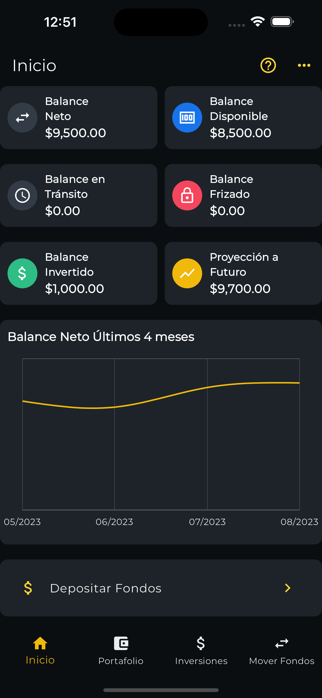

# Bisonte App - Investor Mobile App

Welcome to Bisonte App repository! This mobile app provides you with a convenient way to manage your investments and financial portfolio. 

<table>
  <tr>
    <td>
      
    </td>
    <td>
      
https://github.com/JoseTejada110/clients_dashboard/assets/83741816/14e879ba-d05e-4769-ae50-17ebd8ec9d9b

  </tr>
</table>

## Features

With this app, you have:

- **Real-time Account Information**: View essential account information in real-time.
- **Investment Monitoring**: Keep track of your investments and make well-informed decisions.
- **Diverse Investment Options**: Explore a wide range of investment choices to diversify your portfolio.
- **Deposits**: Easily record your deposits to increase your investment funds.
- **Withdrawal Requests**: Request withdrawals of your earnings quickly and effortlessly.

## Architecture

The Bisonte App is built using a robust and maintainable architecture based on **Clean Architecture**, which includes the Repository Pattern for data management and the Visitor Pattern for comprehensive error handling. This architecture ensures separation of concerns, testability, and maintainability of the codebase.

### Key Components

- **Presentation Layer**: This layer contains the user interface components and interacts with the domain layer. It is responsible for handling user interactions and presenting data to the user.

- **Domain Layer**: The core business logic resides in this layer. It defines entities, use cases, and business rules.

- **Data Layer**: The data layer is responsible for data retrieval and storage. It utilizes the Repository Pattern to abstract data sources, making it easy to switch between different data providers (e.g., API, local database).

- **Core**: Utils functions, constants and error handling using Visitor Pattern. This design pattern allows for a flexible and extensible approach to handling and managing errors. Each error type can be treated individually, providing informative and actionable feedback to the user.

### Benefits of the Architecture

- **Testability**: The clean separation of concerns and dependencies makes it easier to write unit tests for the various components of the app.

- **Maintainability**: Changes in one layer (e.g., switching to a new data source) do not impact other parts of the application, making it easier to maintain and scale the app.

- **Scalability**: The architecture is scalable, allowing for the addition of new features or changes with minimal disruption to existing code.

By adopting Clean Architecture with the Repository Pattern and the Visitor Pattern for error handling, the Nuac Venture Capital Investor Mobile App offers a solid foundation for a secure, maintainable, and feature-rich application.

